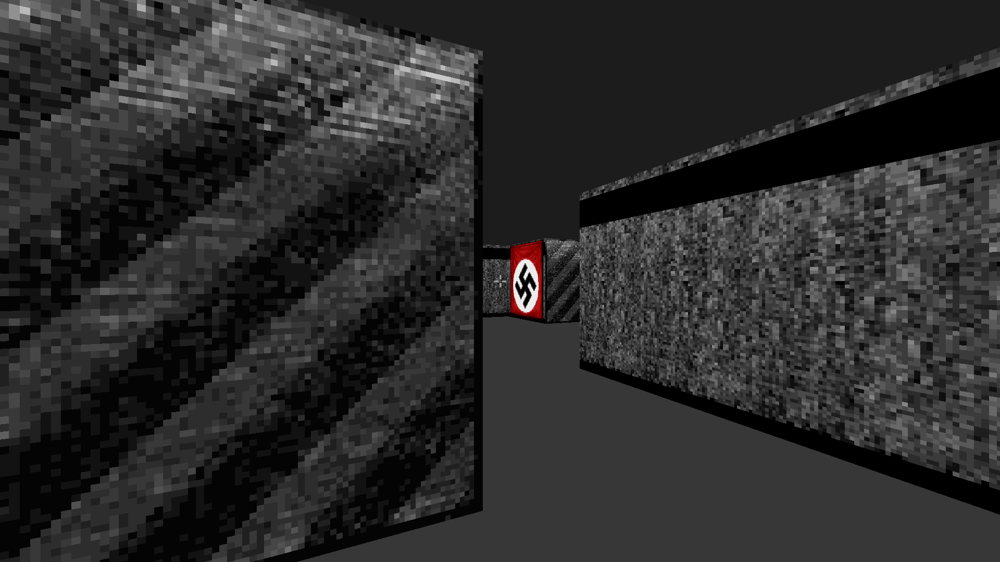

Need to do list [8/24]:
- [x] filter things using triggers
- [x] sprite scale mechanism
- [x] remove broken things
- [x] floor lamps
- [x] fix animated big fan texture
- [x] fix broken lines in l3d levels
- [x] add lamp light on walls
- [x] add lamp light on floor
- [ ] animated decorations
- [ ] sync current discharge sprite and wall
- [ ] add RPG
- [ ] breakable glass
- [ ] friendly NPC AI
- [ ] explosive barrels


- [ ] ends of levels
- [ ] broken door logic
- [ ] add pistols
- [ ] add chaingun
- [ ] flamethrower guy AI
- [ ] foe AI
- [ ] crates logic
- [ ] fix broken texture offset in constructions
- [ ] smart cutter for TOP lines
- [ ] lightnings

## Bunker3D to GZDoom

The goal of this project is to port all the maps and resources from an old 2006-2008 j2me mobile FPS game trilogy: Bunker3D, Laboratory3D and Castle3D by Netsoftware on [GZDoom](https://github.com/ZDoom/gzdoom) engine. The project is planned to serve as a base for a further enhanced port




What does this project do?
1. Runs the java code extracted from the games, modified only to load and export data
1. Heuristic algorithm removes hidden linedefs and resolve overlapping ones, e.g. back side of a crate which fills only bottom half of the level height, overlaps a wall -> this algorithm cuts the wall in this place and leaves only the other top half of the wall
1. Work in progress...

### `.b3d` map format

Despite visual similarities with Doom, these maps have nothing similar with Doom's format. The file contains very complicated data, stored in about 100 arrays. I assume it was made to fit the game in order of hundreds kilobytes. The base geometry is described as sequencies of segments, they are stored as nibble values (halves of bytes). The other geometry is stored as descriptions of geometric shapes: rectangles, circles, incomplete rectangles. The engine in one hand has less restrictions about lines - it's okay to have overlapping walls, walls in out of bounce; but in the other hand it doesn't support sector light (btw was added in Meat2Eat game), and different sector's floor and ceiling level. It doesn't have a "sector" term at all - lines can have different height, but you can't see what's on surfaces on top of them or under neath

### Dependencies

Requires `python`, `java`, `javac` and python dependencies listed below. To run the program extract the original games into `./jars/...` folders, and use `./convert.sh` to convert

```bash
python -m venv env
. env/bin/activate
pip install omgifol pillow svgwrite

```
